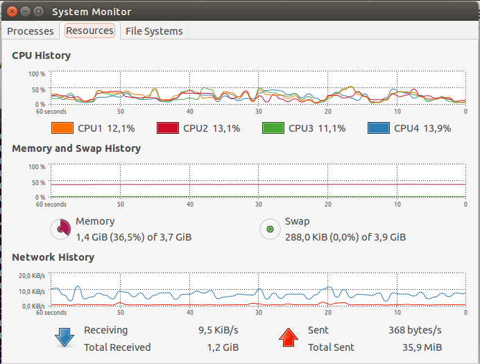
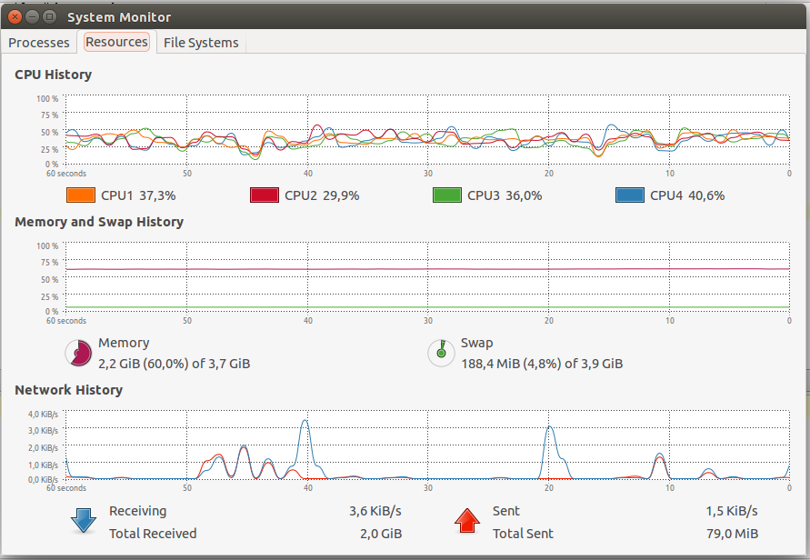
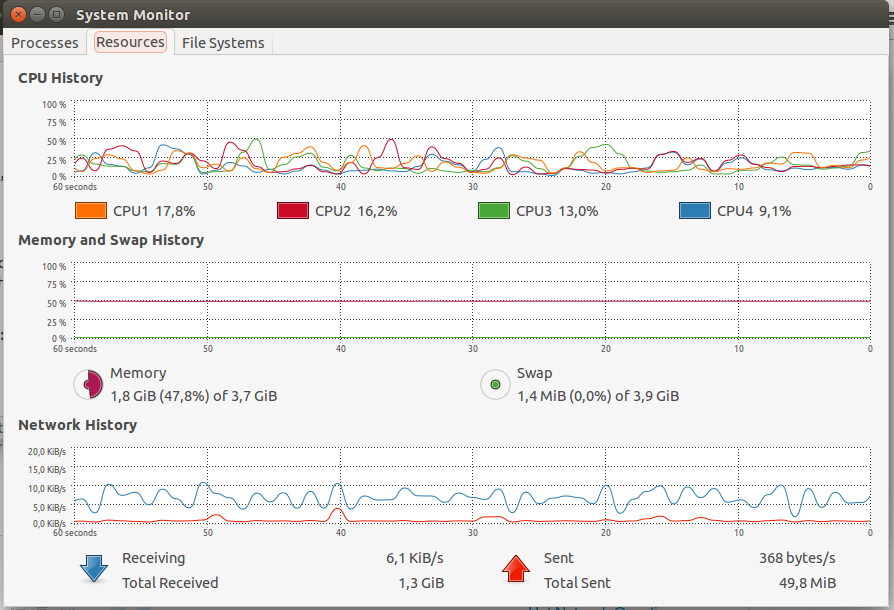

NoSQL_UG - Magdalena Sarzyńska
========

#Wstęp

Wszystkie zadania zostały wykonane na Ubuntu 14.04 LTS.
Sprzęt: Procesor Intel Core i5-M 450 @ 2.40GHz × 4 Dysk HDD 500 GB. Pamięć RAM 4GB.

======

Przetworzyłam plik Train.csv następującymi komendami:
```js
>cat Train.csv | tr "\n" " " | tr "\r" "\n" > Train_changed.csv
```
Sprawdziłam ilość linii w otrzymanym pliku:
```js
>wc -l Train_changed.csv
6034196 Train_changed.csv
```
Usunęłam ostatnią (pustą) linię dodaną podczas korekty początkowej:
```js
>head -n 6034196 Train_changed.csv > Train_changed2.csv
```
Sprawdziłam ilość linii otrzymanych po przetworzeniu pliku:
```js
>wc -l Train_changed2.csv
6034195 Train_changed2.csv
```
========

##Zadanie 1.
a) Zaimportować, do systemów baz danych uruchomionych na swoim komputerze, danych z pliku Train.csv bazy:
- MongoDB
- PostgreSQL

b) Zliczyć liczbę zaimportowanych rekordów (Odpowiedź: powinno ich być 6_034_195).

c) (Zamiana formatu danych.) Zamienić string zawierający tagi na tablicę napisów z tagami następnie zliczyć wszystkie tagi i wszystkie różne tagi.

d) Brak polecenia.

e) Wyszukać w sieci dane zawierające obiekty GeoJSON. Następnie dane zapisać w bazie MongoDB.

========
#MongoBD
#Zad1 a) b)
```sh
time mongoimport -d train -c train --type csv --headerline --file Train_changed2.csv 
```
Wynik operacji:
```sh
Thu Oct 23 17:45:52.165 		Progress: 7196771848/7253917399	99%
Thu Oct 23 17:45:52.165 			5986600	10671/second
Thu Oct 23 17:45:54.693 check 9 6034196
Thu Oct 23 17:45:55.077 imported 6034195 objects
```
Czasy:
```sh
real	9m23.553s
user	1m55.715s
sys	0m14.405s
```


Przeliczenie ilości wystąpień w bazie:
```js
>mongo
MongoDB shell version: 2.4.9
connecting to: test
> use train
switched to db train
> db.train.count()
6034195
```
=======
#c)

Zadanie zostało wykonane przy pomocy PyMongo w programie PyCharm w języku programowania Python. Stworzony skrypt:
```sh
from pymongo import Connection

conn=Connection()
db=conn["train"]
table=db["newone"]
collection = db.train.find(timeout=False)
for i in collection:
    if not (type(i['Tags']) is unicode): continue
    tagi = i['Tags'].split()
    table.insert(i)
    table.update({'_id': i['_id']},{'$set':{'Tags': tagi}},j=False)
collection.close()
```

Otrzymane wyniki:
```sh
   ilość tagów: 17409994
 różnych tagów: 42048
```

Sprawdzenie:
```sh
db.newone.find().limit(2)
```

```sh
{ "Body" : "<p>I'd like to check if an uploaded file is an image file (e.g png, jpg, jpeg, gif, bmp) or another file. The problem is that I'm using Uploadify to upload the files, which changes the mime type and gives a 'text/octal' or something as the mime type, no matter which file type you upload.</p>  <p>Is there a way to check if the uploaded file is an image apart from checking the file extension using PHP?</p> ",
"Id" : 1, 
"Tags" : [ 
	"php", 
	"image-processing", 
	"file-upload", 
	"upload", 
	"mime-types" ], 
"Title" : "How to check if an uploaded file is an image without mime type?", 
"_id" : ObjectId("5449207fec294e11edb4f1f4") }

{ "Body" : "<p>In my favorite editor (vim), I regularly use ctrl-w to execute a certain action. Now, it quite often happens to me that firefox is the active window (on windows) while I still look at vim (thinking vim is the active window) and press ctrl-w which closes firefox. This is not what I want. Is there a way to stop ctrl-w from closing firefox?</p>  <p>Rene</p> ", 
"Id" : 2, 
"Tags" : [ 
	"firefox" ], 
"Title" : "How can I prevent firefox from closing when I press ctrl-w", 
"_id" : ObjectId("5449207fec294e11edb4f1f5") }
```

Czasy:
```sh
real  23m1.730s
user  13m20.031s
sys   0m14.311s
```

Wykorzystanie zasobów podczas przetwarzania pliku:



========

#d)

Dane zostały pobranie ze [strony](http://www.doogal.co.uk/london_stations.php) w formacie csv zawierając położenia stacji w londynie.

Następnie zostały wczytane do bazy mongo poleceniem:
```sh
time mongoimport -d train -c train --type csv --headerline --file London\ stations.csv 
```

Dane zostały przetworzone przy pomocy PyMongo w programie PyCharm w języku programowania Python. Stworzony skrypt:
```sh
from pymongo import Connection

conn=Connection()
db=conn["train"]
table=db["newone"]
collection = db.train.find(timeout=False)
for i in collection:
    geo = { "station": i["Station"],
    "loc": { "type":"Point", "coordinates": [ i["Longitude"] , i["Latitude"] ] }
    };
    table.insert(geo)
collection.close()
```


Oraz dodaję index:
```sh
db.newone.ensureIndex({"loc" : "2dsphere"})
```

Przykładowy wynik:
```sh
{ "_id" : ObjectId("544a4c2df6552e11dea52b44"), "loc" : { "type" : "Point", "coordinates" : [  -0.014848686252722,  51.477547665535 ] }, "station" : "Greenwich" }
```

Wszystkie [wyniki](screens/wyniki.json).


 	
#$near - v1
Wybieram punkt (Big Ben):
```sh
var point = { "type" : "Point", "coordinates" : [-0.124625, 51.500729]};
```

Wykonuję zapytanie:
```sh
>db.newone.find({ loc: {$near: {$geometry: point}, $maxDistance: 150} }).toArray()
```

Wynik:
```sh
[
	{
		"_id" : ObjectId("544a4c2df6552e11dea52cb2"),
		"loc" : {
			"type" : "Point",
			"coordinates" : [
				-0.12498767440679,
				51.501401606172
			]
		},
		"station" : "Westminster"
	}
]

```

Prezentacja wyników:


#$near - v2
Wybieram punkt:
```sh
var point = { "type" : "Point", "coordinates" : [0.16, 51.46]};
```

Wykonuję zapytanie:
```sh
>db.newone2.find({ loc: {$near: {$geometry: point}, $maxDistance: 1000} }).toArray()
```

Wynik:
```sh
[
	{
		"_id" : ObjectId("5457be9800f4888e7410c5fd"),
		"station" : "Barnehurst",
		"loc" : {
			"type" : "Point",
			"coordinates" : [
				0.16096241569889,
				51.464780266606
			]
		}
	}
]
```

Prezentacja wyników:


#$geoWithin - center
Wykonuję zapytanie:
```sh
db.newone.find({ loc: {$geoWithin : { $center : [ [ -0.1213397,51.5169996 ] , 0.008] } }}).toArray();
```
wynik:
```sh
[
	{
		"_id" : ObjectId("544a4c2df6552e11dea52ae8"),
		"loc" : {
			"type" : "Point",
			"coordinates" : [
				-0.1244924862088,
				51.512760249622
			]
		},
		"station" : "Covent Garden"
	},
	{
		"_id" : ObjectId("544a4c2df6552e11dea52b71"),
		"loc" : {
			"type" : "Point",
			"coordinates" : [
				-0.11982609759457,
				51.517235749261
			]
		},
		"station" : "Holborn"
	},
	{
		"_id" : ObjectId("544a4c2df6552e11dea52c1e"),
		"loc" : {
			"type" : "Point",
			"coordinates" : [
				-0.12457578611157,
				51.523013052867
			]
		},
		"station" : "Russell Square"
	}
]
```
Prezentacja wyników:


#$geoWithin - Box
Wykonuję zapytanie:
```sh
db.newone.find({ loc : { $geoWithin : { $box : [ [ -0.075 , 51.515 ] , [0.12, 51.52] ] } } }).toArray();
```
wynik:
```sh
[
	{
		"_id" : ObjectId("5457be9800f4888e7410c5eb"),
		"station" : "Aldgate East",
		"loc" : {
			"type" : "Point",
			"coordinates" : [
				-0.072987053548915,
				51.515081631079
			]
		}
	},
	{
		"_id" : ObjectId("5457be9800f4888e7410c719"),
		"station" : "Langdon Park",
		"loc" : {
			"type" : "Point",
			"coordinates" : [
				-0.015199388573999,
				51.518883939693
			]
		}
	},
	{
		"_id" : ObjectId("5457be9800f4888e7410c830"),
		"station" : "Whitechapel",
		"loc" : {
			"type" : "Point",
			"coordinates" : [
				-0.059406074587337,
				51.519587792346
			]
		}
	}
]
```
Prezentacja wyników:


#$geoIntersects - Polygon
```sh
var obszar = { "type" : "Polygon", "coordinates" : [ [ [ -0.125 , 51.53 ], [ -0.119 , 51.53 ], [ -0.119 , 51.5 ], [ -0.125 , 51.5 ], [ -0.125 , 51.53 ] ] ] };

```
Wykonuję zapytanie:
```sh
db.newone.find({ loc : { $geoIntersects : { $geometry : obszar } } }).toArray();
```

wynik (jeden z 6 elementów):
```sh
	{
		"_id" : ObjectId("544a4c2df6552e11dea52b71"),
		"loc" : {
			"type" : "Point",
			"coordinates" : [
				-0.11982609759457,
				51.517235749261
			]
		},
		"station" : "Holborn"
	}
```
Prezentacja wyników:


#$geoIntersects - LineString

```sh
var linia = { "type": "LineString", "coordinates": [ [ -0.119 , 51.5 ] , [ -0.125 , 51.53 ] ] };
```

Wykonuję zapytanie:
```sh
db.newone.find({ loc : { $geoIntersects : { $geometry : linia } } }).toArray();
```

Prezentacja wyników:


========
#PostgreSQL
#Zad1 a) b)
początkowo trzeba stworzyć tabelę:
```sh
>psql magda
>>CREATE TABLE train (Id serial PRIMARY KEY, Title VARCHAR, Body VARCHAR, Tags VARCHAR);
```

PostgreSQL umożliwia mieżenie czasu komendą:
```sh
>\timing
```

w wyniku czego otrzymany został czas oraz automatycznie wynik zliczenia wszystkich wierszy:
```sh
magda=# COPY train (Id, Title, Body, Tags) FROM '/home/magda/Pobrane/Train_changed2.csv' WITH DELIMITER ',' CSV HEADER;
COPY 6034195
Time: 889515,013 ms
```
czyli w przeliczeniu otrzymany został czas 14m49.515s



Przeliczenie ilości wystąpień w bazie:
```sh
>SELECT COUNT(*) FROM train;
  count
`---------
 6034195
(1 row)

Time: 394345,551 ms
```

===

