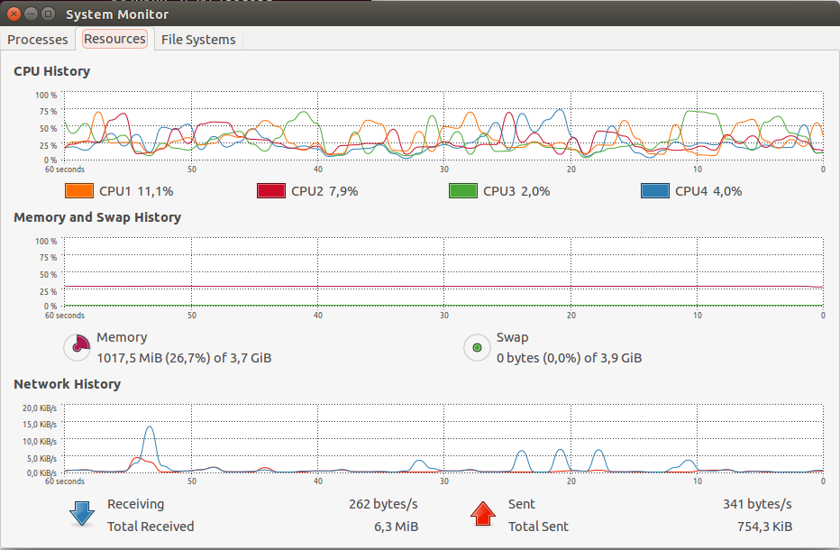
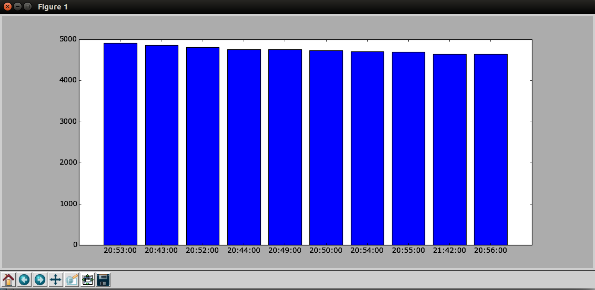
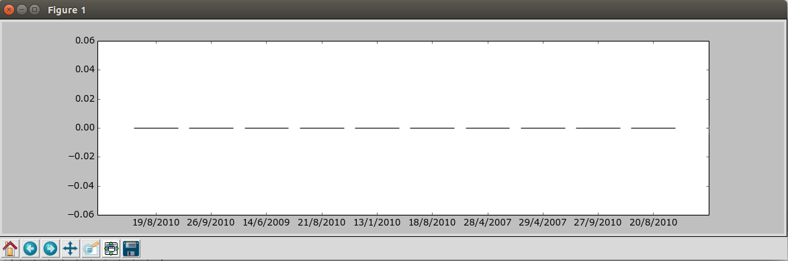
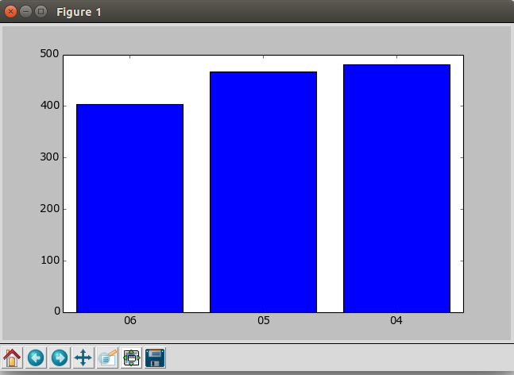
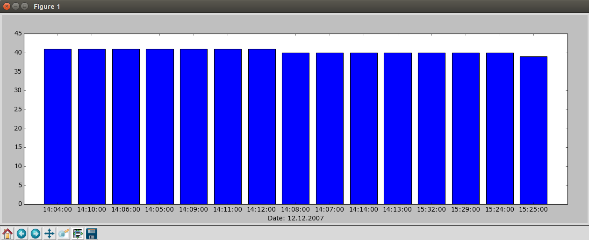

NoSQL_UG - Magdalena Sarzyńska
========

#Wstęp

Wszystkie zadania zostały wykonane na Ubuntu 14.04 LTS.
Sprzęt: Procesor Intel Core i5-M 450 @ 2.40GHz × 4 Dysk HDD 500 GB. Pamięć RAM 4GB.

======

##Zadanie 2.

a) Wyszukać w sieci dane zawierające co najmniej 1_000_000 rekordów/jsonów.

b) Dane zapisać w bazie MongoDB.

c) Przygotować w JavaScript co najmniej cztery agregacje korzystające z Aggregation Pipeline.

d) Zaprogramować i wykonać wszystkie agregacje z pkt. 3 w_innym niż JavaScript języku programowania. Skorzystać z jednego z driverów wymienionych na stronie MongoDB Drivers.

e) Wyniki przedstawić w postaci tabelek, graficznej (wykresów, itp.).

=======

#zad 2. a)

Dane zostały ściągnięte ze [strony](http://archive.ics.uci.edu/ml/datasets/Individual+household+electric+power+consumption), link to pliku z danymi: [link](http://archive.ics.uci.edu/ml/machine-learning-databases/00235/household_power_consumption.zip) plik zip zawierający 2075259 rekordów z 9 atrybutami każdy. Plik zawiera informacje dotyczące zużycia prądu.

Przykładowy rekord:
```sh
Date;Time;Global_active_power;Global_reactive_power;Voltage;Global_intensity;Sub_metering_1;Sub_metering_2;Sub_metering_3
16/12/2006;17:24:00;4.216;0.418;234.840;18.400;0.000;1.000;17.000
```

Oraz poprawiam dane poleceniem:
```sh
cat household_power_consumption.txt | tr ";" "," > power.txt 
```

Przykładowy wynik po poprawie:
```sh
>head -n 3 power.txt 
Date,Time,Global_active_power,Global_reactive_power,Voltage,Global_intensity,Sub_metering_1,Sub_metering_2,Sub_metering_3
16/12/2006,17:24:00,4.216,0.418,234.840,18.400,0.000,1.000,17.000
16/12/2006,17:25:00,5.360,0.436,233.630,23.000,0.000,1.000,16.000
```

======

#zad 2. b)

Wczytywanie danych do bazy Mongo:
```sh
time mongoimport -d power -c power --type csv --headerline --file power.txt
```

Wynik operacji:
```sh
Fri Oct 31 21:28:06.022 		Progress: 131383460/132960755	98%
Fri Oct 31 21:28:06.022 			2051200	34186/second
Fri Oct 31 21:28:06.598 check 9 2075260
Fri Oct 31 21:28:07.310 imported 2075259 objects
```

Czasy:
```sh
real	1m1.264s
user	0m6.460s
sys	0m1.388s
```



Sprawdzenie poprawnego wprowadzenia wyników:
```sh
> db.power.find().limit(1)
{	
	"_id" : ObjectId("5453f425c520b3a1d86d3b80"), 
	"Date" : "16/12/2006", 
	"Time" : "17:24:00", 
	"Global_active_power" : 4.216, 
	"Global_reactive_power" : 0.418, 
	"Voltage" : 234.84, 
	"Global_intensity" : 18.4, 
	"Sub_metering_1" : 0, 
	"Sub_metering_2" : 1, 
	"Sub_metering_3" : 17 
}
```

Oraz przeliczenie wprowadzonych danych:
```sh
db.power.count()
2075259
```


Wczytywanie danych do bazy Mongo:
```sh
time ./mongoimport -d power2 -c power2 --type csv --headerline --file ~/Pobrane/power.txt
```

Wynik operacji:
```sh
2014-11-19T18:01:17.973+0100	Progress: 2050000 documents inserted...
2014-11-19T18:01:18.203+0100	Progress: 2060000 documents inserted...
2014-11-19T18:01:18.424+0100	Progress: 2070000 documents inserted...
2014-11-19T18:01:21.605+0100	imported 2075259 documents
```

Czasy:
```sh
real	1m16.006s
user	1m28.382s
sys	0m7.880s
```

Oraz przeliczenie wprowadzonych danych:
```sh
MongoDB shell version: 2.8.0-rc0
connecting to: test
> use power2
switched to db power2
> db.power2.count()
2075259
> 
```

| Baza Danych          |                    Czas                             |
|----------------------|-----------------------------------------------------|
|   MongoDB v 2.4.12   | real: 1m1.264s    user: 0m6.460s     sys: 0m1.388s  |
| MongoDB v 2.8.0-rc0  | real: 1m16.006s   user: 1m28.382s    sys: 0m7.880s  |

#zad 2. c) d) e)

#Pipeline aggregation 1

Sprawdzenie łącznego zapotrzebowania na prąd z taryfy nr 1 o danej porze (10 największych pozycji).

#I) JavaScript

Skrypt:
```js
var coll = db.power;
var result = coll.aggregate(
  { $group: {_id: {"Time": "$Time"}, count: {$sum: "$Sub_metering_1"}}},
  { $sort : {count : -1}},
  { $limit: 10});

print("actions: " + result.result.length);
printjson(result);
```

Prezentacja wyników:
```js
>time mongo power agg1.js
MongoDB shell version: 2.4.12
connecting to: power
actions: 10
{
	"result" : [
		{"_id" : {"Time" : "20:53:00"},	"count" : 4906},
		{"_id" : {"Time" : "20:43:00"}, "count" : 4857},
		{"_id" : {"Time" : "20:52:00"}, "count" : 4808},
		{"_id" : {"Time" : "20:44:00"},	"count" : 4759},
		{"_id" : {"Time" : "20:49:00"},	"count" : 4754},
		{"_id" : {"Time" : "20:50:00"},	"count" : 4738},
		{"_id" : {"Time" : "20:54:00"},	"count" : 4712},
		{"_id" : {"Time" : "20:55:00"},	"count" : 4694},
		{"_id" : {"Time" : "21:42:00"},	"count" : 4643},
		{"_id" : {"Time" : "20:56:00"},	"count" : 4637}
	],
	"ok" : 1
}
```
Czasy dla Mongo v 2.4.12: 
```js
real	0m2.912s
user	0m0.030s
sys	0m0.019s
```

Czasy dla Mongo v 2.8.0-rc0:
```
real	0m2.866s
user	0m0.048s
sys	0m0.008s
```
Jak widać dla Mongo w wersji 2.8.0-rc0 wyniki [image](files/agg1jserror.md) są w odwrotnej kolejności, po nich zaś następują błędy.

#II)Python

Skrypt:
```js
from bson.son import SON
from pymongo import Connection
import json

conn=Connection()
db=conn["power"]
result = db.power.aggregate([
  { "$group": {"_id": {"Time": "$Time"}, "count": {"$sum": "$Sub_metering_1"}}},
  { "$sort" : SON([("count" , -1)])},
  { "$limit": 10}]
)
print json.dumps(result, indent=4)
```

Prezentacja wyników:
```js
{
    "ok": 1.0, 
    "result": [
        {"count": 4906.0, "_id": {"Time": "20:53:00"}}, 
        {"count": 4857.0, "_id": {"Time": "20:43:00"}}, 
        {"count": 4808.0, "_id": {"Time": "20:52:00"}}, 
        {"count": 4759.0, "_id": {"Time": "20:44:00"}}, 
        {"count": 4754.0, "_id": {"Time": "20:49:00"}}, 
        {"count": 4738.0, "_id": {"Time": "20:50:00"}}, 
        {"count": 4712.0, "_id": {"Time": "20:54:00"}}, 
        {"count": 4694.0, "_id": {"Time": "20:55:00"}}, 
        {"count": 4643.0, "_id": {"Time": "21:42:00"}}, 
        {"count": 4637.0, "_id": {"Time": "20:56:00"}}
    ]
}
```
Czasy dla Mongo v 2.4.12:
```js
real    0m1.834s
user    0m2.480s
sys	0m0.126s

Czasy dla Mongo v 2.8.0-rc0:
```js
real    0m2.869s
user    0m0.060s
sys     0m0.005s
```

Prezentacja graficzna wyników:



#III)Porównanie czasów

|    |    Mongo v 2.4.12            |    Mongo v 2.8.0-rc0          |
|----------------------------------:|:-----------------------------:|
|    |   JavaScript    |   Python   |   JavaScript     |   Python   |
|---:|:---------------:|:----------:|:----------------:|:----------:|
|real|	0m2.912s       |  0m1.834s  |	0m2.912s       |  0m1.834s  |
|user|	0m0.030s       |  0m2.480s  |	0m0.030s       |  0m2.480s  |
|sys |	0m0.019s       |  0m0.126s  |	0m0.019s       |  0m0.126s  |

#Pipeline aggregation 2

#I)JavaScript

10 dat, kiedy najmniej korzystało się z taryfy 3  (10 najmniejszych pozycji).
```js
var coll = db.power;

var result = coll.aggregate(
  { $group: {_id: {"Date": "$Date"}, count: {$sum: "$Sub_metering_3"}}},
  { $sort : {count : 1}},
  { $limit: 10});

print("actions: " + result.result.length);
printjson(result);
```

Prezentacja wyników:
```js
>time mongo power agg2.js
MongoDB shell version: 2.4.12
connecting to: power
actions: 10
{
	"result" : [
		{"_id" : {"Date" : "19/8/2010"},"count" : 0},
		{"_id" : {"Date" : "26/9/2010"},"count" : 0},
		{"_id" : {"Date" : "14/6/2009"},"count" : 0},
		{"_id" : {"Date" : "21/8/2010"},"count" : 0},
		{"_id" : {"Date" : "13/1/2010"},"count" : 0},
		{"_id" : {"Date" : "18/8/2010"},"count" : 0},
		{"_id" : {"Date" : "28/4/2007"},"count" : 0},
		{"_id" : {"Date" : "29/4/2007"},"count" : 0},
		{"_id" : {"Date" : "27/9/2010"},"count" : 0},
		{"_id" : {"Date" : "20/8/2010"},"count" : 0}
	],
	"ok" : 1
}
```
Czasy dla Mongo v 2.4.12:
```js
real	0m2.696s
user	0m0.032s
sys	0m0.020s
```

Czasy dla Mongo v 2.8.0-rc0:
```
real	0m2.717s
user	0m0.052s
sys	0m0.012s
```
Jak widać dla Mongo w wersji 2.8.0-rc0 wyniki [image](files/agg2jserror.md) są w odwrotnej kolejności, po nich zaś następują błędy.

#II)Python
```js
from bson.son import SON
from pymongo import Connection
import json

conn=Connection()
db=conn["power"]

result = db.power.aggregate([
  { "$group": {"_id": {"Date": "$Date"}, "count": {"$sum": "$Sub_metering_3"}}},
  { "$sort" : SON([("count" , 1)])},
  { "$limit": 10}])
print json.dumps(result, indent=4)
```

Prezentacja wyników:
```js
{
    "ok": 1.0, 
    "result": [
        {"count": 0, "_id": {"Date": "19/8/2010"}}, 
        {"count": 0, "_id": {"Date": "26/9/2010"}}, 
        {"count": 0, "_id": {"Date": "14/6/2009"}}, 
        {"count": 0, "_id": {"Date": "21/8/2010"}}, 
        {"count": 0, "_id": {"Date": "13/1/2010"}}, 
        {"count": 0, "_id": {"Date": "18/8/2010"}}, 
        {"count": 0, "_id": {"Date": "28/4/2007"}}, 
        {"count": 0, "_id": {"Date": "29/4/2007"}}, 
        {"count": 0, "_id": {"Date": "27/9/2010"}}, 
        {"count": 0, "_id": {"Date": "20/8/2010"}}
    ]
}
```
Czasy dla Mongo v 2.4.12:
```js
real    0m1.831s
user    0m2.446s
sys     0m0.170s
```

Czasy dla Mongo v 2.8.0-rc0:
```
real    0m2.720s
user    0m0.056s
sys     0m0.011s
```

Prezentacja graficzna wyników:



#III)Porównanie czasów

|    |   JavaScript    |   Python   |
|----|-----------------|------------|
|real|	0m2.696s       |  0m1.831s  |
|user|	0m0.032s       |  0m2.446s  |
|sys |	0m0.020s       |  0m0.170s  |

#Pipeline aggregation 3

#I)JavaScript

Najmniejsze 3 zurzycia taryfy 1 o danej godzinie.
```js
var coll = db.power;

var result = coll.aggregate(
  {$project : {
	hour: {$substr : ["$Time", 0, 2]},
	sub: {"Sub_metering_1": "$Sub_metering_1"}
  }},
{ $group: {_id: {"hour": "$hour", subd : "$sub.Sub_metering_1"}}},
{ $group: {_id: "$_id.hour", count: {$sum: "$_id.subd"}}},
  { $sort : {count : 1}},
  { $limit: 3});

print("actions: " + result.result.length);
printjson(result);
```

Prezentacja wyników:
```js
> time mongo power agg3.js
MongoDB shell version: 2.4.12
connecting to: power
actions: 3
{
	"result" : [
		{"_id" : "06", "count" : 403},
		{"_id" : "05", "count" : 467},
		{"_id" : "04", "count" : 480}
	],
	"ok" : 1
}
```
Czasy dla Mongo v 2.4.12:
```js
real	0m7.951s
user	0m0.045s
sys	0m0.012s
```

Czasy dla Mongo v 2.8.0-rc0:
```
real	0m7.711s
user	0m0.049s
sys	0m0.012s
```
Jak widać dla Mongo w wersji 2.8.0-rc0 wyniki [image](files/agg3jserror.md) są w odwrotnej kolejności, po nich zaś następują błędy.

#II)Python
```js
from bson.son import SON
from pymongo import Connection
import json

conn=Connection()
db=conn["power"]

result = db.power.aggregate([
  {"$project" : {
	"hour": {"$substr" : ["$Time", 0, 2]},
	"sub": {"Sub_metering_1": "$Sub_metering_1"}}},
  { "$group": {"_id": {"hour": "$hour", "subd" : "$sub.Sub_metering_1"}}},
  { "$group": {"_id": "$_id.hour", "count": {"$sum": "$_id.subd"}}},
  { "$sort" : SON([("count" , 1)])},
  { "$limit": 3}]);

print json.dumps(result, indent=4)
```

Prezentacja wyników:
```js
{
    "ok": 1.0, 
    "result": [
        {"count": 403.0, "_id": "06"}, 
        {"count": 467.0,"_id": "05"}, 
        {"count": 480.0,"_id": "04"}
    ]
}
```
Czasy dla Mongo v 2.4.12:
```js
real    0m2.888s
user    0m2.254s
sys     0m0.227s
```

Czasy dla Mongo v 2.8.0-rc0:
```
real    0m7.819s
user    0m0.047s
sys     0m0.021s
```

Prezentacja graficzna wyników:



#III)Porównanie czasów

|    |   JavaScript    |   Python   |
|----|-----------------|------------|
|real|	0m7.951s       |  0m2.888s  |
|user|	0m0.045s       |  0m2.254s  |
|sys |	0m0.012s       |  0m0.227s  |

#Pipeline aggregation 4

#I)JavaScript

Dnia 12.12.2007 o której godzinie było największe zurzycie prądu (łącznie taryfa 1, 2 i 3) uszeregowane od największego (15 pierwszych pozycji.
```js
var coll = db.power;

var result = coll.aggregate(
{ $match: { "Date" : "12/12/2007" } },
{ $project: {_id: {
"Date" : "$Date",
"Time" : "$Time",
}, wynik: { $add: ["$Sub_metering_3","$Sub_metering_2", "$Sub_metering_1"]}}},
  { $sort : {wynik : -1}},
  { $limit: 15});

print("actions: " + result.result.length);
printjson(result);
```


Prezentacja wyników:
```js
> time mongo power agg4.js
MongoDB shell version: 2.4.12
connecting to: power
actions: 15
{
	"result" : [
		{"_id" : {"Date" : "12/12/2007","Time" : "14:04:00"},
			"wynik" : 41},
		{"_id" : {"Date" : "12/12/2007","Time" : "14:10:00"},
			"wynik" : 41},
		{"_id" : {"Date" : "12/12/2007","Time" : "14:06:00"},
			"wynik" : 41},
		{"_id" : {"Date" : "12/12/2007","Time" : "14:05:00"},
			"wynik" : 41},
		{"_id" : {"Date" : "12/12/2007","Time" : "14:09:00"},
			"wynik" : 41},
		{"_id" : {"Date" : "12/12/2007","Time" : "14:11:00"},
			"wynik" : 41},
		{"_id" : {"Date" : "12/12/2007","Time" : "14:12:00"},
			"wynik" : 41},
		{"_id" : {"Date" : "12/12/2007","Time" : "14:08:00"},
			"wynik" : 40},
		{"_id" : {"Date" : "12/12/2007","Time" : "14:07:00"},
			"wynik" : 40},
		{"_id" : {"Date" : "12/12/2007","Time" : "14:14:00"},
			"wynik" : 40},
		{"_id" : {"Date" : "12/12/2007","Time" : "14:13:00"},
			"wynik" : 40},
		{"_id" : {"Date" : "12/12/2007","Time" : "15:32:00"},
			"wynik" : 40},
		{"_id" : {"Date" : "12/12/2007","Time" : "15:29:00"},
			"wynik" : 40},
		{"_id" : {"Date" : "12/12/2007","Time" : "15:24:00"},
			"wynik" : 40},
		{"_id" : {"Date" : "12/12/2007","Time" : "15:25:00"},
			"wynik" : 39}
	],
	"ok" : 1
}
```
Czasy dla Mongo v 2.4.12:
```js
real	0m0.779s
user	0m0.041s
sys	0m0.015s
```

Czasy dla Mongo v 2.8.0-rc0:
```
real	0m0.760s
user	0m0.047s
sys	0m0.019s
```
Jak widać dla Mongo w wersji 2.8.0-rc0 wyniki [image](files/agg4jserror.md) są w odwrotnej kolejności, po nich zaś następują błędy.

#II)Python
```js
from bson.son import SON
from pymongo import Connection
import json

conn=Connection()
db=conn["power"]

result = db.power.aggregate([
  { "$match": { "Date" : "12/12/2007" } },
  { "$project": {"_id": {
      "Date" : "$Date",
      "Time" : "$Time",
      }, "wynik": { "$add": ["$Sub_metering_3","$Sub_metering_2", "$Sub_metering_1"]}}},
  { "$sort" : {"wynik" : -1}},
  { "$limit": 15}]);

print json.dumps(result, indent=4)
```

Prezentacja wyników:
```js
{
    "ok": 1.0, 
    "result": [
        {"_id": {"Date": "12/12/2007","Time": "14:04:00"}, 
            "wynik": 41.0}, 
        {"_id": {"Date": "12/12/2007","Time": "14:10:00"}, 
            "wynik": 41.0}, 
        {"_id": {"Date": "12/12/2007","Time": "14:06:00"}, 
            "wynik": 41.0}, 
        {"_id": {"Date": "12/12/2007","Time": "14:05:00"}, 
            "wynik": 41.0}, 
        {"_id": {"Date": "12/12/2007","Time": "14:09:00"}, 
            "wynik": 41.0}, 
        {"_id": {"Date": "12/12/2007","Time": "14:11:00"}, 
            "wynik": 41.0}, 
        {"_id": {"Date": "12/12/2007","Time": "14:12:00"}, 
            "wynik": 41.0}, 
        {"_id": {"Date": "12/12/2007","Time": "14:08:00"}, 
            "wynik": 40.0}, 
        {"_id": {"Date": "12/12/2007","Time": "14:07:00"}, 
            "wynik": 40.0}, 
        {"_id": {"Date": "12/12/2007","Time": "14:14:00"}, 
            "wynik": 40.0}, 
        {"_id": {"Date": "12/12/2007","Time": "14:13:00"}, 
            "wynik": 40.0}, 
        {"_id": {"Date": "12/12/2007","Time": "15:32:00"}, 
            "wynik": 40.0}, 
        {"_id": {"Date": "12/12/2007","Time": "15:29:00"}, 
            "wynik": 40.0}, 
        {"_id": {"Date": "12/12/2007","Time": "15:24:00"}, 
            "wynik": 40.0}, 
        {"_id": {"Date": "12/12/2007","Time": "15:25:00"}, 
            "wynik": 39.0}
    ]
}
```
Czasy dla Mongo v 2.4.12:
```js
real    0m1.843s
user    0m2.471s
sys     0m0.139s
```

Czasy dla Mongo v 2.8.0-rc0:
```
real    0m0.771s
user    0m0.042s
sys     0m0.026s
```

Prezentacja graficzna wyników:



#III)Porównanie czasów

|    |   JavaScript    |   Python   |
|----|-----------------|------------|
|real|	0m0.779s       |  0m1.843s  |
|user|	0m0.041s       |  0m2.471s  |
|sys |	0m0.015s       |  0m0.139s  |

