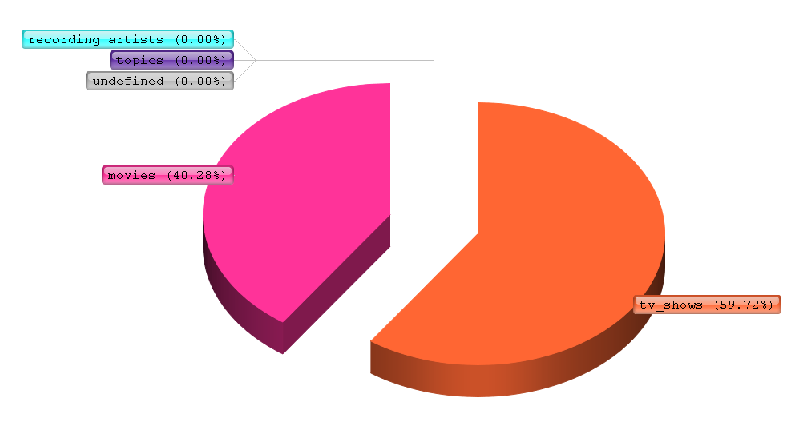

NoSQL_UG - Magdalena Sarzyńska
========

#Wstęp

Wszystkie zadania zostały wykonane na Ubuntu 14.04 LTS.
Sprzęt: Procesor Intel Core i5-M 450 @ 2.40GHz × 4 Dysk HDD 500 GB. Pamięć RAM 4GB.

======

##Zadanie 3.

[GetGlue and Timestamped Event Data](http://getglue-data.s3.amazonaws.com/getglue_sample.tar.gz) (ok. `11 GB`, `19 831 300` json-ów, próbka 100 jsonów [getglue101](https://github.com/nosql/aggregations-2/blob/master/data/wbzyl/getglue101.json)). Są to dane z [IMDB](http://www.imdb.com/) z lat 2007–2012, tylko filmy i przedstawienia TV. 

Przykładowy dokument `json`:

```js
{
  "_id": ObjectId("5374418642gf2a2b34540421"),
  "comment": "", 
  "modelName": "movies", 
  "displayName": "", 
  "title": "Short Circuit", 
  "timestamp": "2008-10-29T04:50:41Z", 
  "image": "http://ia.media-imdb.com/images/M/MV5BMTM3NzIwNjE4OV5BMl5BanBnXkFtZTcwNjk0MTUxMQ@@.jpg", 
  "userId": "brianhaddad", 
  "private": "false", 
  "director": "john badham", 
  "source": "", 
  "version": "1", 
  "link": "http://www.imdb.com/title/tt0091949/", 
  "lastModified": "2011-12-16T19:39:33Z", 
  "action": "Liked", 
  "lctitle": "short circuit", 
  "objectKey": "movies/short_circuit/john_badham"
}
```

Po rozpakowaniu ściągniętego pliku z danymi poleceniem:
```js
tar -xf getglue_sample.tar.gz
```

Należy dane wczytać do bazy danych. Wykorzystana w tym celu będzie wersja Mongo 2.8.0.rc0 + wiredtiger +zlib, a następnie Mongo 2.4.12. Następnie w tabeli przedstawione będą czasy działania.

======

##Wczytanie danych do bazy Mongo 2.8.0.rc0 + wiredtiger + zlib

```js
./mongod --storageEngine=wiredtiger --wiredTigerCollectionConfig=zlib
time ./mongoimport -d imdb -c imdb --type json --file ../../getglue_sample.json
```

Wynik:
```sh
...
2015-01-08T00:01:17.973+0100    Progress: 19602500 documents inserted...
2015-01-08T00:01:18.203+0100    Progress: 19663900 documents inserted...
2015-01-08T00:01:18.424+0100    Progress: 19779800 documents inserted...
2015-01-08T00:01:21.605+0100    imported 19831300 documents
```

Czas:
```js
real	15m12.158s
user	6m12.119s
sys	0m32.654s
```

Sprawdzenie:
```sh
mongo
MongoDB shell version: 2.8.0-rc0
connecting to: test
> use imdb
switched to db imdb2
> db.imdb.count()
19831300
```

##Wczytanie danych do bazy Mongo 2.4.12

```js
time mongoimport -d imdb2 -c imdb2 --type json --file getglue_sample.json
```

Wynik:
```sh
Thu Jan  8 00:15:54.007 			19602700	18050/second
Thu Jan  8 00:15:57.005 		Progress: 11367988192/11454208342	99%
Thu Jan  8 00:15:57.005 			19679900	18071/second
Thu Jan  8 00:16:00.057 		Progress: 11425068413/11454208342	99%
Thu Jan  8 00:16:00.057 			19779700	18113/second
Thu Jan  8 00:16:02.365 check 9 19831301
Thu Jan  8 00:16:02.792 imported 19831300 objects
```

Czas:
```js
real	18m14.128s
user	7m18.132s
sys	0m36.657s
```

Sprawdzenie:
```sh
mongo
MongoDB shell version: 2.4.12
connecting to: test
> use imdb2
switched to db imdb2
> db.imdb2.count()
19831300
```

| Baza Danych                             | Czas rzeczywisty | Czas systemowy | Objętość bazy danych |
|-----------------------------------------|------------------|----------------|----------------------|
| MongoDB v 2.4.12                        |    18m14.128s    |   0m36.657s    |        15.946GB      |
| MongoDB v 2.8.0-rc0 WiredTiger (zlib)   |    15m12.158s    |   0m32.654s    |        12.531GB      |


=====

#suma kontrolna oraz ilość kategorii(ModelName):
Skrypt
```js
baza = db.imdb;

map = function(){
  var x = this.modelName;
  emit(x,1);
};

reduce = function(key,values){
  return Array.sum(values);
};


var a = baza.mapReduce(map, reduce, {out: "wynik"});
printjson(a);
``` 

Wynik:
```js
connecting to: imdb
{
	"result" : "wynik",
	"timeMillis" : 282043,
	"counts" : {
		"input" : 19831300,
		"emit" : 19831300,
		"reduce" : 324535,
		"output" : 5
	},
	"ok" : 1,
}
```

Rodajów kategorii było 5.

```js
db.wynik.find().limit(5)
{ "_id" : "tv_shows", "value" : 9737305 }
{ "_id" : "movies", "value" : 6568019 }
{ "_id" : "undefined", "value" : 56 }
{ "_id" : "topics", "value" : 23 }
{ "_id" : "recording_artists", "value" : 11 }
```

Czas dla Mongo 2.8.0.rc0:
```js
real	4m02.421s
user	0m0.052s
sys	0m0.011s
```


Czas dla Mongo 2.4.12:
```js
real	4m42.119s
user	0m0.039s
sys	0m0.016s
```



#zliczenie używanych tytułów

Skrypt
```js
baza = db.imdb;

map = function(){
  var x = this.title;
  emit(x,1);
};

reduce = function(key,values){
  var result = 0;
  values.forEach(function(item){
     result += item;
  });
  return result;
};


var a = baza.mapReduce(map, reduce, {out: "wynik"});
printjson(a);
``` 

Wynik:
```js
{
	"result" : "wynik",
	"timeMillis" : 828431,
	"counts" : {
		"input" : 19831300,
		"emit" : 19831300,
		"reduce" : 2600667,
		"output" : 52618
	},
	"ok" : 1,
}
```
Przykładowe rekordy
```js
db.wynik.find().limit(20)
{ "_id" : "!Viva Hollywood!", "value" : 2 }
{ "_id" : "!Women Art Revolution", "value" : 2 }
{ "_id" : "\"...First Do No Harm\"", "value" : 1 }
{ "_id" : "\"Alien Nation\" at TV.com", "value" : 4 }
{ "_id" : "\"The Girl Who Kicked The Hornet's Nest", "value" : 1 }
{ "_id" : "\"Weird Al\" Yankovic Live! - The Alpocalypse Tour", "value" : 1 }
{ "_id" : "\"iCarly\" iGo to Japan", "value" : 7 }
{ "_id" : "\"the SHed show\" with Andy Dick", "value" : 1 }
{ "_id" : "#1 Cheerleader Camp", "value" : 7 }
{ "_id" : "#1 Single", "value" : 1 }
{ "_id" : "#TheYear With Katie Couric", "value" : 252 }
{ "_id" : "$#*! My Dad Says", "value" : 1406 }
{ "_id" : "$1.98 Beauty Show", "value" : 1 }
{ "_id" : "$10,000 Pyramid", "value" : 2 }
{ "_id" : "$100 Makeover", "value" : 3 }
{ "_id" : "$40 A Day", "value" : 75 }
{ "_id" : "$5 Cover", "value" : 1060 }
{ "_id" : "$5 a Day", "value" : 62 }
{ "_id" : "$9.99", "value" : 18 }
{ "_id" : "$h*! My Dad Says", "value" : 3 }
```

Czas dla Mongo 2.8.0.rc0:
```js
real	11m64.542s
user	0m0.031s
sys	0m0.051s
```

Czas Mongo 2.4.12:
```js
real	13m48.508s
user	0m0.045s
sys	0m0.008s
```


#powtarzające się inicjały w zakładce director dla wszystkich filmów

Skrypt
```js
baza = db.imdb;

map = function(key,values){
  if (this.modelName == "movies") {
  this.director.match(/\b\w/g).join("").forEach(function(word) {
     emit(word,1);
  });}
};

reduce = function(key,values){
return Array.sum(values);
};

var a = baza.mapReduce(map, reduce, {out: "wynik"});
printjson(a);
``` 

Wynik:
```js
connecting to: imdb
{
	"result" : "wynik",
	"timeMillis" : 429832,
	"counts" : {
		"input" : 19831300,
		"emit" : 13756198,
		"reduce" : 1017539,
		"output" : 41456
	},
	"ok" : 1,
}
```

Przykładowe rekordy
```js
> db.wynik.find().limit(2000)
...
{ "_id" : "IA", "value" : 641 }
{ "_id" : "IB", "value" : 112 }
{ "_id" : "IC", "value" : 146 }
{ "_id" : "ID", "value" : 2764 }
{ "_id" : "IE", "value" : 241 }
{ "_id" : "IF", "value" : 6361 }
...
```

Czas dla Mongo 2.8.0.rc0:
```js
real	6m643.553s
user	0m0.026s
sys	0m0.015s
```

Czas  Mongo 2.4.12:
```js
real	7m9.886s
user	0m0.036s
sys	0m0.018s
```

#Porównanie wyników:

| Baza Danych                           | suma kontrolna   |   używane tytuły   |    inicjały    |
|---------------------------------------|------------------|--------------------|----------------|
| MongoDB v 2.4.12 - czas rzeczywisty   |    4m42.119s     |     13m48.508s     |    7m9.886s    |
| MongoDB v 2.4.12 - czas systemowy     |    0m0.016s      |     0m0.008s       |    0m0.018s    |
| MongoDB v 2.8.0-rc0 WiredTiger (zlib) - czas rzeczywisty |  4m02.421s  |  11m64.542s   | 6m43.553s |
| MongoDB v 2.8.0-rc0 WiredTiger (zlib) - czas systemowy   |  0m0.011s   |  0m0.051s     | 0m0.015s  |

Jak widać dla każdego z przypadków MongoDB w wersji 2.8.0-rc0 używając WiredTiger z zlib wypadło lepiej niż dla wersji 2.4.12. Dla bardziej skomplikowanych obliczeń (przypadek drugi) zmiana ta jest dużo bardziej zauważalna.

=====

#Optymalizacja MapReduce

#modyfikacja skryptu dla sumy kontrolnej oraz ilości kategorii(ModelName):

Należało trochę przerobić skrypt z mapReduce na runCommand:
```js
baza = db.imdb;

map = function(){
  var x = this.modelName;
  emit(x,1);
};

reduce = function(key,values){
  return Array.sum(values);
};

var b = baza.runCommand({
  mapreduce: "imdb",
  map: map,
  reduce: reduce,
  out: "wynik",
  jsMode: true
})
printjson(b);
```

Wynik jak widać jest ten sam:
```js
connecting to: imdb
{
	"result" : "wynik",
	"timeMillis" : 248266,
	"counts" : {
		"input" : 19831300,
		"emit" : 19831300,
		"reduce" : 324711,
		"output" : 5
	},
	"ok" : 1
}
```

Następnie trzeba przerobić program na wielowątkowy:
```js
baza = db.imdb;

load("parallel.js");

var res = db.runCommand({
  splitVector: "imdb.imdb",
  keyPattern: {_id: 1},
  maxChunkSizeBytes: 4*1024*1024
});

var keys = res.splitKeys;

map = function(){
  var x = this.modelName;
  emit(x,1);
};

reduce = function(key,values){
  return Array.sum(values);
};

var command = function(min,max){
 return baza.runCommand({
    mapreduce: "imdb",
    map: map,
    reduce: reduce,
    out: "wynik"+min,
    query: {_id: {$gte: min, $lt: max}},
 })};

var numberCores = 4
var inc = (Math.floor(keys.length) / numberCores) + 1;
threads = [];
//Run MapReduce in threads
for (var i = 0; i < numberCores; ++i) {
   var min = (i == 0) ? 0 : keys[i * inc].modelName;
   var max = (i * inc + inc >= keys.length) ? MaxKey : keys[i * inc + inc].modelName ;
   print("min:" + min + " max:" + max);
   var t = new ScopedThread(command, min, max);
   threads.push(t);
   t.start()
}
//Print results on threads
for (var i in threads){
  var t = threads[i];
  t.join();
  printjson(t.returnData());
}
```

Otrzymane wyniki (fragment, gdyż było ich za dużo):
```js
min:0 max:216321
min:216321 max:394279
min:394279 max:642171
min:642171 max:[object MaxKey]
connecting to: test
connecting to: test
connecting to: test
connecting to: test
{
  "result" : "wynik0",
    "timeMillis" : 26369,
    "counts" : {
        "input" : 524168,
        "emit" : 524168,
        "reduce" : 65272,
        "output" : 5
    },
    "ok" : 1
}
{
    "result" : "wynik216321",
    "timeMillis" : 25731,
    "counts" : {
        "input" : 495425,
        "emit" : 495425,
        "reduce" : 5326,
        "output" : 5
    },
    "ok" : 1
}
{
    "result" : "wynik394279",
    "timeMillis" : 19368,
    "counts" : {
        "input" : 486525,
        "emit" : 486525,
        "reduce" : 1466,
        "output" : 5
    },
    "ok" : 1
}
{
    "result" : "wynik642171",
    "timeMillis" : 14703,
    "counts" : {
        "input" : 456525,
        "emit" : 456525,
        "reduce" : 1484,
        "output" : 5
    },
    "ok" : 1
}
```

Pozostałe skrypty zostały przekształcone w sposób adekwatny (JSMode ON) - poprzez wykorzystanie tego samego kodu, modyfikując funkcje map, reduce , runCommand:

-dla użyte tytuły:

```js
map = function(){
  var x = this.title;
  emit(x,1);
};

reduce = function(key,values){
  var result = 0;
  values.forEach(function(item){
     result += item;
  });
  return result;
};

var b = baza.runCommand({
  mapreduce: "imdb",
  map: map,
  reduce: reduce,
  out: "wynik",
  jsMode: true
})
```

-dla inicjały
```js
map = function(key, values){
  if (this.modelName == "movies") {
  this.director.match(/\b\w/g).join("").forEach(function(word) {
     emit(word,1);
  });}
};

reduce = function(key,values){
  return Array.sum(values);
};

var b = baza.runCommand({
  mapreduce: "imdb",
  map: map,
  reduce: reduce,
  out: "wynik",
  jsMode: true
})
```


Zestawienie wyników: 

| Rodzaj problemu | MongoDB 2.4.12 | Mongo 2.8.0.rc0 - Bez optymalizacji | Mongo 2.8.0.rc0 - JSMode |   Mongo 2.8.0.rc0 - Zapisanie do różnych kolekcji |
|-----------------|----------------|---------------------|--------------------|-------------------------------|
| kategorie - czas rzeczywisty      | 4m42.119s  | 4m02.421s  | 3m98.532s  | 3m09.963s |
| kategorie - czas systemowy        | 0m0.016s   | 0m0.011s   | 0m0.0631s  | 0m0.051s  |
| używane tytuły - czas rzeczywisty | 13m48.508s | 11m64.542s | 11m21.625s |  |
| używane tytuły - czas systemowy   | 0m0.008s   | 0m0.051s   | 0m0.513s   |  |
| inicjały - czas rzeczywisty       | 7m9.886s   | 6m43.553s  | 6m0.542s   |  |
| inicjały - czas systemowy         | 0m0.018s   | 0m0.015s   | 0m0.063s   |  |


Jak łatwo zaobserwować dużo lepiej korzystać z programowania współbieżnego, lecz już samo zastosowanie JSMode poprawiło (niewiele) czas działania.

